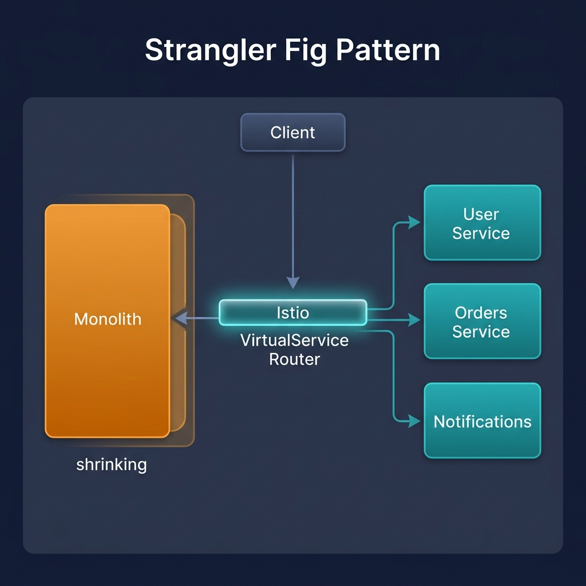
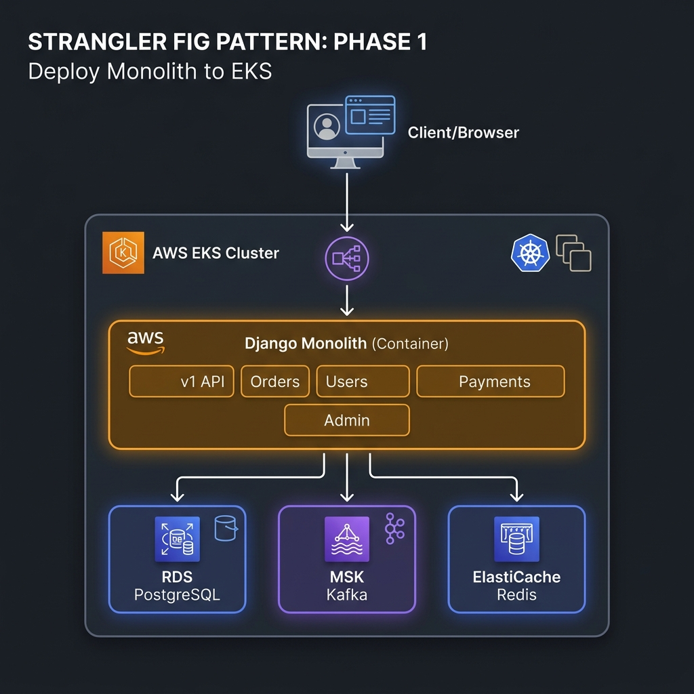
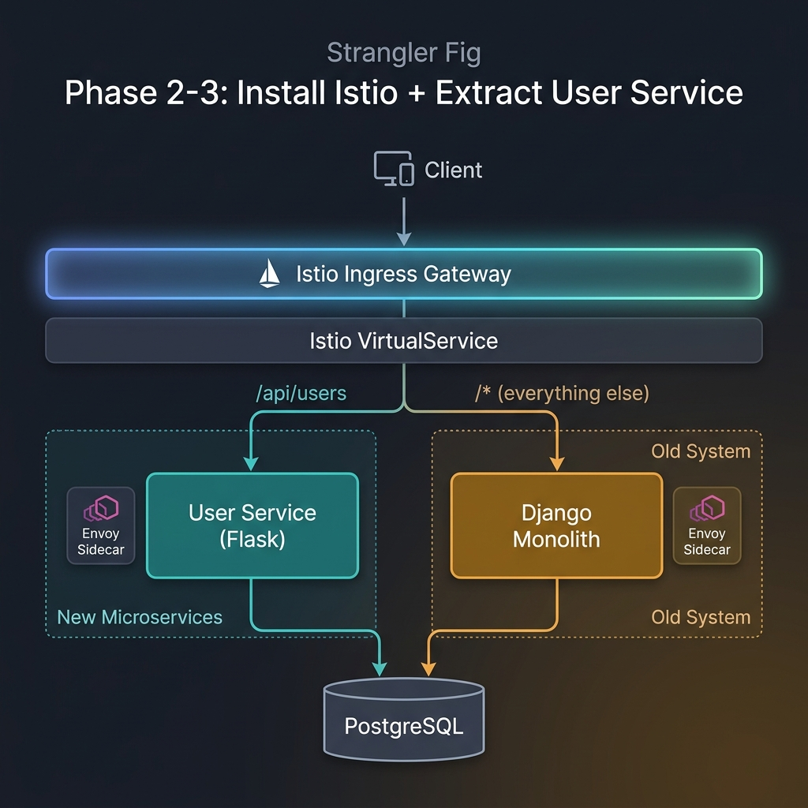
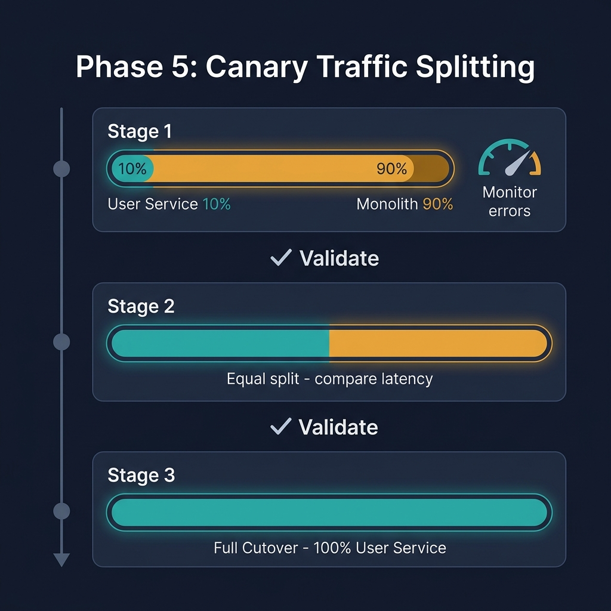
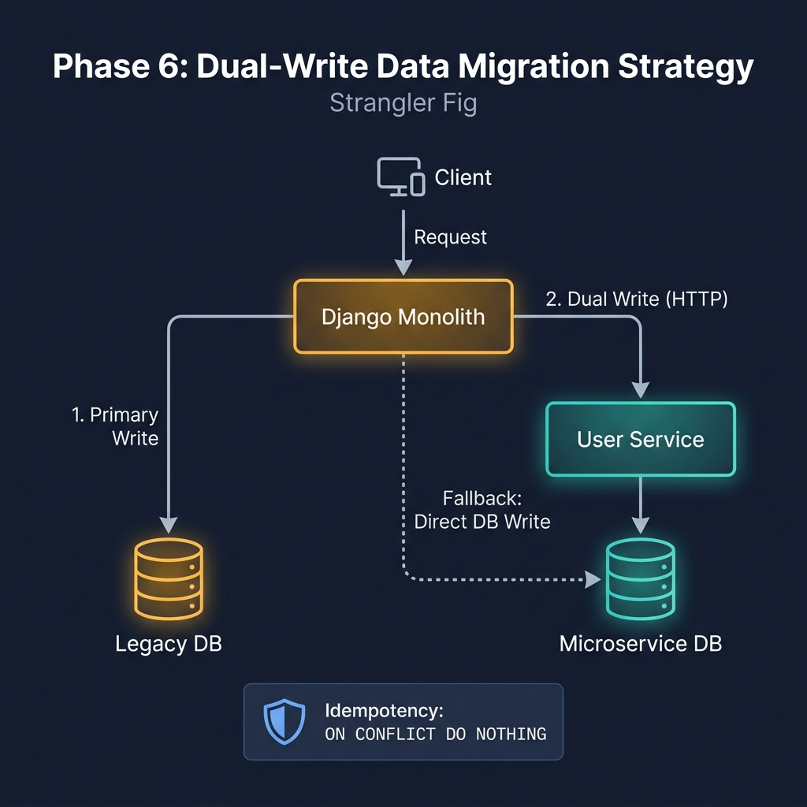
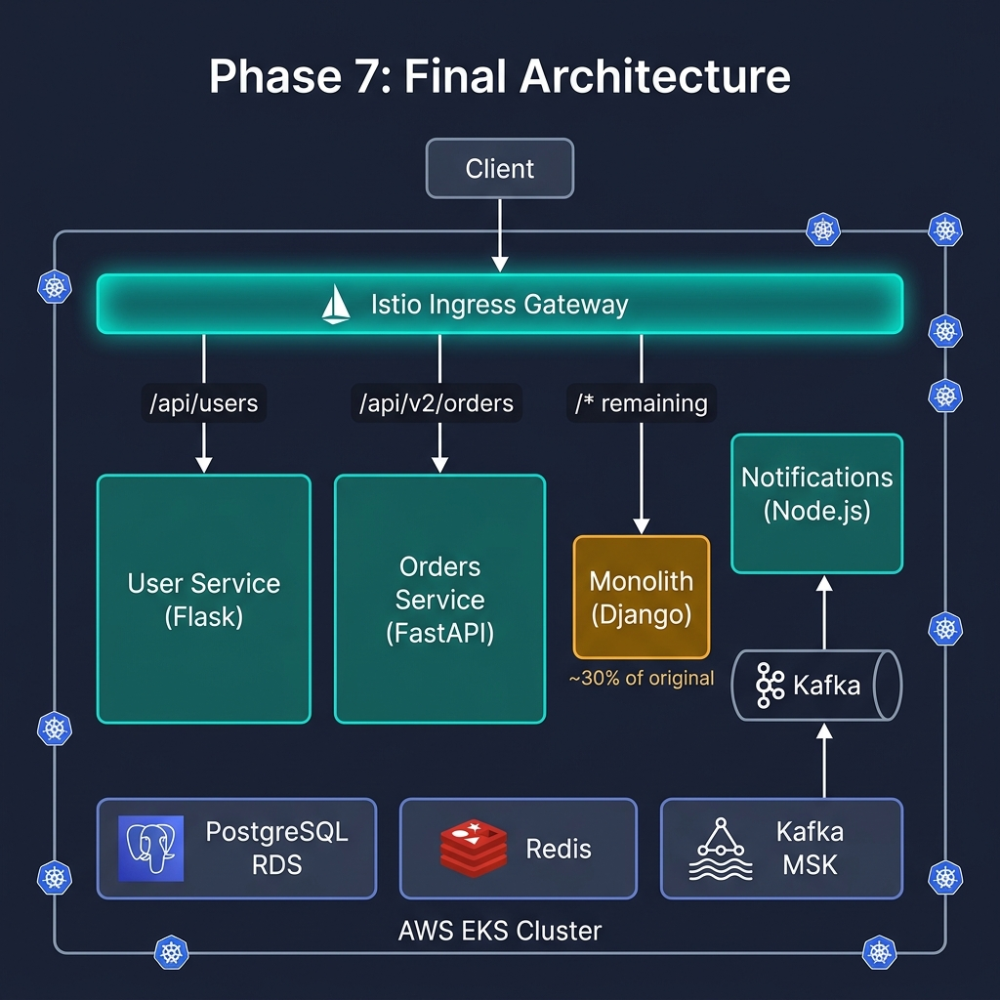

# How to Use the Strangler Fig Pattern to Migrate Monoliths to Microservices on AWS EKS

> A practical guide to incrementally migrating a monolithic application to microservices on AWS EKS using the Strangler Fig pattern with Istio traffic routing.

---

Rewriting a monolith from scratch almost never works. The big-bang approach is risky, expensive, and often ends in failure. The **Strangler Fig pattern** takes a different approach — inspired by the strangler fig tree, which grows around an existing tree and gradually replaces it. You build new features as microservices, incrementally route traffic from the monolith to the new services, and eventually the monolith withers away.

In this guide, we walk through implementing the Strangler Fig pattern on **AWS EKS**, using **Istio** for traffic routing so we can gradually shift functionality from a monolith to new microservices **without any downtime**.

---

## The Migration Strategy

The key idea is simple: put a routing layer in front of your monolith that can selectively forward requests to new microservices. As you extract functionality from the monolith, you update the routing rules. The monolith and microservices run side by side, and users never notice the transition.



> **At any point during the migration, you have a fully working system. You can stop, pause, or roll back without any downtime.**

### Technology Stack

| Layer | Technology | Purpose |
|-------|-----------|---------|
| Infrastructure | AWS EKS, RDS, MSK, ElastiCache | Managed Kubernetes + data |
| Service Mesh | Istio | Traffic routing, observability |
| Monolith | Django 4.2 + DRF | Legacy application |
| Orders Service | FastAPI | Extracted microservice |
| User Service | Flask | Extracted microservice |
| Notifications | Node.js + Express | Event consumer |
| Frontend | React (Vite) | SPA Storefront |
| CI/CD | GitHub Actions | Build, test, deploy |
| Load Testing | K6 | Performance validation |

---

## Phase 1: Deploy the Monolith to EKS

The first step is containerizing the monolith and deploying it to EKS. This gets you onto the platform where you will eventually run your microservices too.



### What We Do

1. **Containerize** the Django monolith using a multi-stage Dockerfile
2. **Add a health endpoint** (`/health/`) for Kubernetes readiness/liveness probes
3. **Configure resource limits** and pod probes
4. **Add version labels** (`version: v1`) for Istio routing

### Add a Health Check Endpoint

Kubernetes needs health endpoints for readiness and liveness probes:

```python
# apps/monolith/monolith/urls.py
from django.http import JsonResponse

def health_check(request):
    """Health check endpoint for Kubernetes readiness/liveness probes."""
    return JsonResponse({"status": "healthy", "service": "monolith"})

urlpatterns = [
    path('health/', health_check, name='health-check'),
    path('admin/', admin.site.urls),
    path('api/v1/', include('core.urls')),
]
```

### Deploy to EKS with Probes and Resource Limits

```yaml
# infra/k8s/templates/monolith.yaml
apiVersion: apps/v1
kind: Deployment
metadata:
  name: monolith
  labels:
    app: monolith
    version: v1
    strangler-fig/role: legacy
spec:
  replicas: 2
  template:
    metadata:
      labels:
        app: monolith
        version: v1
    spec:
      containers:
        - name: monolith
          image: monolith:latest
          ports:
            - containerPort: 8000
          resources:
            requests: { cpu: 500m, memory: 512Mi }
            limits: { cpu: "1", memory: 1Gi }
          readinessProbe:
            httpGet: { path: /health/, port: 8000 }
            initialDelaySeconds: 10
          livenessProbe:
            httpGet: { path: /health/, port: 8000 }
            initialDelaySeconds: 15
```

### Provision AWS Infrastructure

```bash
cd infra/terraform
terraform init
terraform apply
```

---

## Phase 2: Install Istio Service Mesh

Istio gives you fine-grained control over traffic routing, which is essential for the strangler pattern. Install it on your EKS cluster.

### Install Istio

```bash
# Download and install Istio
curl -L https://istio.io/downloadIstio | ISTIO_VERSION=1.22.0 sh -
istioctl install --set profile=default -y

# Enable automatic sidecar injection
kubectl label namespace default istio-injection=enabled

# Install observability addons (Kiali, Grafana, Jaeger)
kubectl apply -f https://raw.githubusercontent.com/istio/istio/release-1.22/samples/addons/kiali.yaml
kubectl apply -f https://raw.githubusercontent.com/istio/istio/release-1.22/samples/addons/grafana.yaml
```

Or use our automated script:

```bash
bash infra/istio/install-istio.sh
```

### Create the Istio Gateway

The Gateway defines the external entry point for all traffic into the mesh:

```yaml
# infra/istio/gateway.yaml
apiVersion: networking.istio.io/v1beta1
kind: Gateway
metadata:
  name: strangler-fig-gateway
spec:
  selector:
    istio: ingressgateway
  servers:
    - port: { number: 80, name: http, protocol: HTTP }
      hosts: ["*"]
```

### Apply Initial Routing – All Traffic → Monolith

```yaml
# infra/istio/virtual-service-phase1.yaml
apiVersion: networking.istio.io/v1beta1
kind: VirtualService
metadata:
  name: strangler-fig-routing
  labels:
    strangler-fig/phase: "1"
spec:
  hosts: ["*"]
  gateways: [strangler-fig-gateway]
  http:
    - route:
        - destination:
            host: monolith
            port: { number: 80 }
          weight: 100
```

```bash
kubectl apply -f infra/istio/gateway.yaml
kubectl apply -f infra/istio/virtual-service-phase1.yaml
```

---

## Phase 3: Extract the User Service

Pick a bounded context from the monolith to extract first. Start with something that has clear boundaries and low risk. We chose **user management** because:

- ✅ Clear boundaries — user CRUD is self-contained
- ✅ Low risk — not on the critical payment path
- ✅ Simple data model — single table, no complex relationships
- ✅ Independent — minimal coupling with orders or payments



### Build the New Microservice

We built a Flask microservice with full CRUD operations:

```python
# apps/user-svc/main.py
from flask import Flask, request, jsonify
import psycopg2

app = Flask(__name__)

@app.route('/api/users', methods=['GET'])
def list_users():
    """List users – previously handled by the monolith."""
    page = request.args.get('page', 1, type=int)
    per_page = min(request.args.get('per_page', 50, type=int), 100)
    offset = (page - 1) * per_page

    conn = get_db_connection()
    with conn.cursor(cursor_factory=psycopg2.extras.RealDictCursor) as cur:
        cur.execute(
            "SELECT id, email, name, created_at FROM users_microservice "
            "ORDER BY created_at DESC LIMIT %s OFFSET %s",
            (per_page, offset)
        )
        users = cur.fetchall()
    conn.close()
    return jsonify({"users": users, "pagination": {...}}), 200

@app.route('/api/users', methods=['POST'])
def create_user():
    """Create a new user."""
    data = request.get_json()
    conn = get_db_connection()
    with conn.cursor(cursor_factory=psycopg2.extras.RealDictCursor) as cur:
        cur.execute(
            "INSERT INTO users_microservice (email, name) VALUES (%s, %s) RETURNING *",
            (data['email'], data['name'])
        )
        user = cur.fetchone()
    conn.commit()
    return jsonify(user), 201

@app.route('/health', methods=['GET'])
def health_check():
    return jsonify({"status": "healthy", "service": "user-svc"}), 200
```

### Deploy Alongside the Monolith

The user-service runs as a separate deployment in the same EKS cluster:

```yaml
# infra/k8s/templates/user-svc.yaml
apiVersion: apps/v1
kind: Deployment
metadata:
  name: user-svc
  labels:
    app: user-svc
    version: v1
    strangler-fig/phase: "3"
spec:
  replicas: 2
  template:
    spec:
      containers:
        - name: user-svc
          image: user-svc:latest
          ports: [{ containerPort: 8002 }]
          readinessProbe:
            httpGet: { path: /health, port: 8002 }
---
apiVersion: v1
kind: Service
metadata:
  name: user-svc
spec:
  selector: { app: user-svc }
  ports: [{ port: 80, targetPort: 8002 }]
```

---

## Phase 4: Route Traffic to the New Service

Update the VirtualService to route user-related requests to the new microservice while everything else still goes to the monolith.

```yaml
# infra/istio/virtual-service-phase4.yaml
http:
  # User endpoints → New User Microservice
  - match:
      - uri:
          prefix: /api/users
    route:
      - destination:
          host: user-svc
          port: { number: 80 }
        weight: 100

  # Orders v2 → Orders Microservice (already extracted)
  - match:
      - uri:
          prefix: /api/v2/orders
    route:
      - destination:
          host: orders-svc
          port: { number: 80 }

  # Everything else → Monolith
  - route:
      - destination:
          host: monolith
          port: { number: 80 }
```

```bash
kubectl apply -f infra/istio/virtual-service-phase4.yaml
```

---

## Phase 5: Canary Traffic Splitting

Before routing all user traffic to the new service, do a **gradual rollout**. Start with 10% of traffic and increase as you gain confidence.



### Stage 1: 10% Traffic to User Service

```yaml
# infra/istio/virtual-service-canary-10.yaml
- match:
    - uri:
        prefix: /api/users
  route:
    - destination: { host: user-svc }
      weight: 10       # 10% → new service
    - destination: { host: monolith }
      weight: 90       # 90% → monolith
```

### Stage 2: 50% Traffic (Equal Split)

```yaml
# infra/istio/virtual-service-canary-50.yaml
  route:
    - destination: { host: user-svc }
      weight: 50
    - destination: { host: monolith }
      weight: 50
```

### Stage 3: 100% (Full Cutover)

```yaml
# infra/istio/virtual-service-canary-100.yaml
  route:
    - destination: { host: user-svc }
      weight: 100
```

### Automated Canary Rollout

We built an automated script that progresses through each stage with health checks between stages:

```bash
# Interactive mode (confirms between stages)
bash infra/k8s/scripts/istio_canary_rollout.sh

# Auto mode (30-second pauses between stages)
bash infra/k8s/scripts/istio_canary_rollout.sh --auto
```

### Validate the Traffic Split

Use our K6 canary validation test to statistically verify the split:

```bash
k6 run tests/k6/canary-validation.js --env EXPECTED_WEIGHT=50
```

Example output:
```
=== Canary Validation Results ===
Expected split: 50% microservice / 50% monolith
Actual split:   48.5% microservice / 51.5% monolith
Tolerance:      ±10%
Result:         ✅ PASS
================================
```

---

## Phase 6: Data Migration Strategy

One of the trickiest parts of the strangler pattern is handling data. Our approach: **dual writes** during the transition period.



### How Dual Writes Work

During migration, the monolith writes to both its own database AND the user-service database:

```python
# apps/monolith/core/dual_write.py

DUAL_WRITE_ENABLED = os.environ.get('DUAL_WRITE_ENABLED', 'true') == 'true'
USER_SVC_URL = os.environ.get('USER_SVC_URL', 'http://user-svc')

def dual_write_user_http(user_data: dict):
    """Primary: write via HTTP to the user-service."""
    if not DUAL_WRITE_ENABLED:
        return None
    try:
        response = requests.post(
            f"{USER_SVC_URL}/api/users",
            json=user_data, timeout=5
        )
        if response.status_code in (200, 201):
            return response.json()
        elif response.status_code == 409:
            return None  # Already exists (idempotent)
    except requests.exceptions.RequestException:
        return dual_write_user_db(user_data)  # Fallback

def dual_write_user_db(user_data: dict):
    """Fallback: write directly to the user-service database."""
    conn = psycopg2.connect(USER_SVC_DB_URL)
    with conn.cursor() as cur:
        cur.execute(
            """INSERT INTO users_microservice (email, name, migrated_from)
               VALUES (%s, %s, 'dual-write')
               ON CONFLICT (email) DO NOTHING""",
            (user_data['email'], user_data['name'])
        )
    conn.commit()
```

### Key Properties

| Property | How It Works |
|----------|-------------|
| **Environment-controlled** | Toggle via `DUAL_WRITE_ENABLED=true/false` |
| **Idempotent** | `ON CONFLICT DO NOTHING` + HTTP 409 handling |
| **Fault-tolerant** | HTTP failure → direct DB fallback |
| **Non-blocking** | Failures are logged, never block the primary write |

### Circuit Breaking with Istio DestinationRules

```yaml
# infra/istio/destination-rules.yaml
apiVersion: networking.istio.io/v1beta1
kind: DestinationRule
metadata:
  name: user-svc-destination
spec:
  host: user-svc
  trafficPolicy:
    connectionPool:
      tcp: { maxConnections: 100 }
      http: { maxRetries: 3 }
    outlierDetection:
      consecutive5xxErrors: 5
      baseEjectionTime: 30s
      maxEjectionPercent: 50
```

---

## Phase 7: Remove the Old Code

Once the new service handles 100% of user traffic, remove the user-related code from the monolith. The monolith gets smaller with each extraction.



### Steps

1. **Verify no traffic reaches the monolith** for user endpoints
2. **Disable dual-writes**: `kubectl set env deployment/monolith DUAL_WRITE_ENABLED=false`
3. **Remove user code** from the monolith codebase
4. **Rebuild and redeploy** the slimmed monolith
5. **Apply final routing**: `kubectl apply -f infra/istio/virtual-service-final.yaml`
6. **Update migration tracker**: `migration-status.yaml`

### Final Routing Configuration

```yaml
# infra/istio/virtual-service-final.yaml
http:
  # Users → User Microservice
  - match: [{ uri: { prefix: /api/users }}]
    route: [{ destination: { host: user-svc, port: { number: 80 }}}]

  # Orders → Orders Microservice
  - match: [{ uri: { prefix: /api/v2/orders }}]
    route: [{ destination: { host: orders-svc, port: { number: 80 }}}]

  # Everything remaining → Monolith (~30% of original)
  - route: [{ destination: { host: monolith, port: { number: 80 }}}]
```

### Rollback (Instant)

At any point, you can roll back to the monolith with a single command:

```bash
kubectl apply -f infra/istio/virtual-service-phase1.yaml
```

---

## Monitoring & Observability

### Key Metrics to Watch During Migration

| Metric | Source | Threshold |
|--------|--------|-----------|
| Error rate (5xx) | Istio | < 1% |
| P95 latency | Istio | < 500ms |
| Request rate | Istio | Stable ± 5% |
| Kafka consumer lag | MSK | < 100 messages |
| Pod restarts | Kubernetes | 0 |

### Access Observability Dashboards

```bash
istioctl dashboard kiali         # Service mesh topology
istioctl dashboard grafana       # Metrics & dashboards
istioctl dashboard jaeger        # Distributed tracing
```

---

## Quick Reference

| Phase | Description | Command |
|-------|-------------|---------|
| **1** | All traffic → Monolith | `kubectl apply -f infra/istio/virtual-service-phase1.yaml` |
| **2** | Install Istio | `bash infra/istio/install-istio.sh` |
| **3** | Deploy User Service | `helm upgrade --install demo infra/k8s` |
| **4** | Route users → User Svc | `kubectl apply -f infra/istio/virtual-service-phase4.yaml` |
| **5** | Canary rollout | `bash infra/k8s/scripts/istio_canary_rollout.sh` |
| **6** | Enable dual-writes | `kubectl set env deploy/monolith DUAL_WRITE_ENABLED=true` |
| **7** | Final state | `kubectl apply -f infra/istio/virtual-service-final.yaml` |
| **🚨** | **Rollback** | `kubectl apply -f infra/istio/virtual-service-phase1.yaml` |
